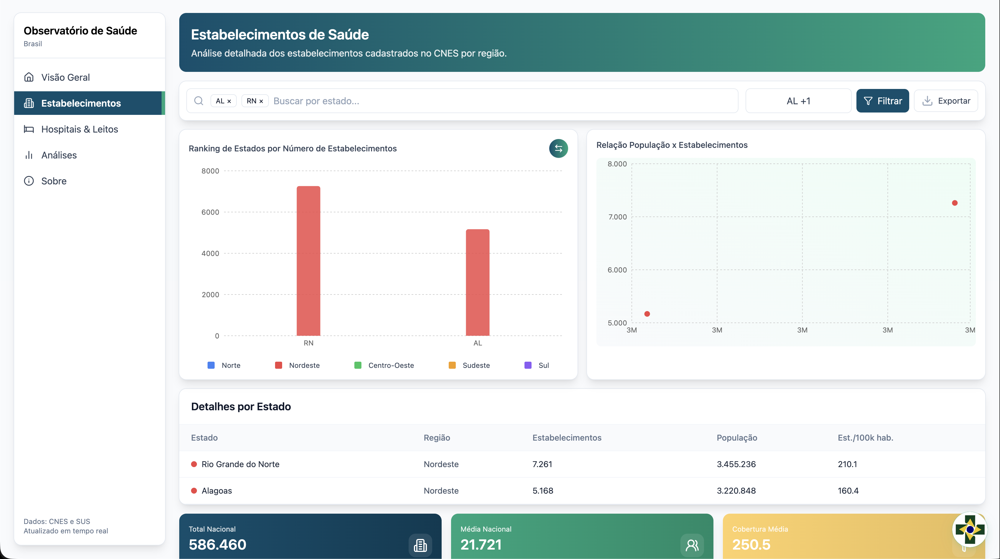
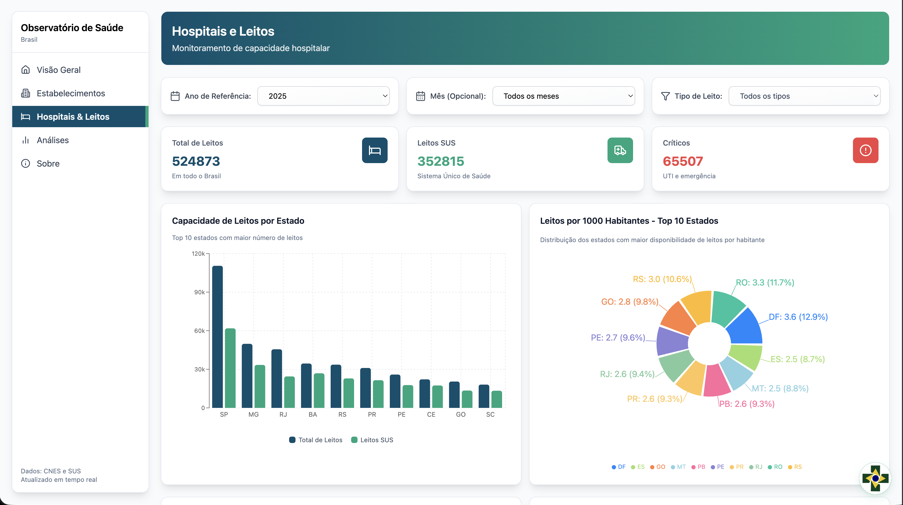
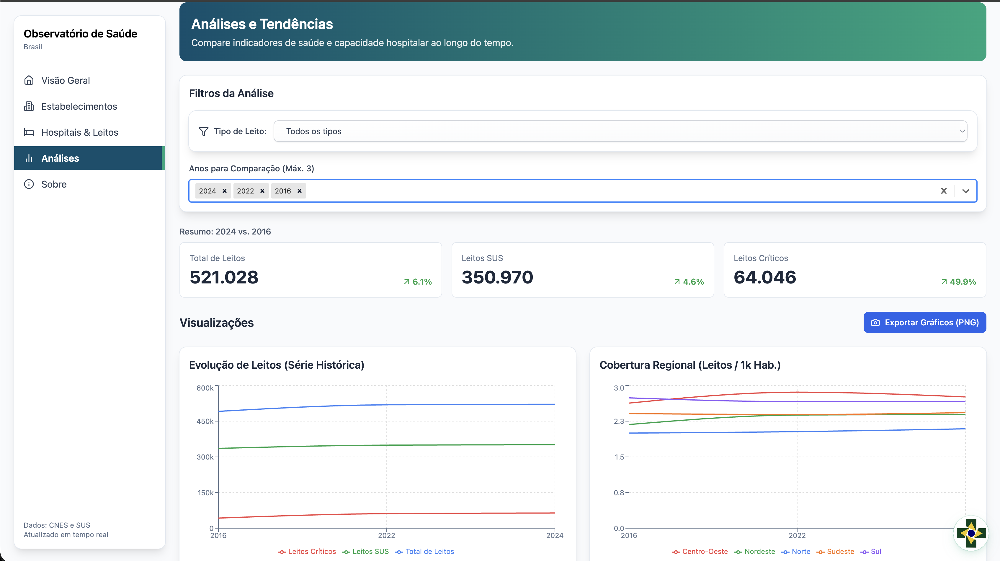
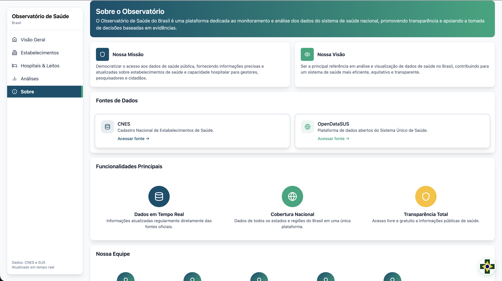

-----

# 🏥 Observatório Saúde - Frontend


> **Interface web moderna para visualização de indicadores de saúde pública, monitoramento de capacidade hospitalar e gestão de dados do SUS.**

Este projeto é a interface cliente que consome a API do [Observatório Saúde Backend](https://github.com/eDusVx/observatorio-saude).

---

## 📸 Visão Geral do Projeto

A aplicação foi desenvolvida com foco em UX/UI limpa, responsividade e performance, oferecendo ferramentas analíticas para gestores e cidadãos.

### 1. Dashboard Executivo & Chatbot
Painel com os principais KPIs do Brasil, incluindo mapas de calor para cobertura de leitos e um **Assistente Virtual** integrado para responder dúvidas em linguagem natural.
<br>
<div align="center">
  
</div>

### 2. Rede de Estabelecimentos
Análise detalhada da infraestrutura física. Inclui rankings estaduais, relação habitantes/estabelecimento e filtros geográficos avançados.
<br>
<div align="center">
  
</div>

### 3. Capacidade Hospitalar (Leitos)
Monitoramento profundo da ocupação. Gráficos comparativos (SUS vs. Privado), Top 10 estados e busca detalhada por hospitais específicos.
<br>
<div align="center">
  
</div>

### 4. Análises Históricas e Tendências
Ferramentas de Business Intelligence (BI) para estudo de séries temporais (2021-2024), permitindo identificar a evolução ou retração da rede de saúde.
<br>
<div align="center">
  
</div>

### 5. Transparência Institucional
Página dedicada à transparência, listando as fontes de dados oficiais (CNES, OpenDataSUS) e a equipe responsável pelo desenvolvimento.
<br>
<div align="center">
  
</div>

---

## 🚀 Tecnologias

O projeto utiliza uma stack moderna focada em **Performance** e **Tipagem Estática**:

| Tecnologia | Função |
| :--- | :--- |
| **[React](https://react.dev/)** | Biblioteca principal de UI baseada em componentes. |
| **[TypeScript](https://www.typescriptlang.org/)** | Superset JS para garantir segurança de tipos e manutenibilidade. |
| **[Vite](https://vitejs.dev/)** | Build tool de próxima geração para desenvolvimento ultra-rápido. |
| **[Tailwind CSS](https://tailwindcss.com/)** | Framework utility-first para estilização ágil e responsiva. |
| **[ESLint](https://eslint.org/)** | Linter para padronização e qualidade de código. |

---

## ⚙️ Instalação e Execução

Siga os passos abaixo para rodar o projeto localmente.

### Pré-requisitos
* **Node.js** (v16.x ou superior)
* Gerenciador de pacotes (**npm** ou **yarn**)

### Passo a Passo

1. **Clone o repositório**
   ```bash
   git clone [https://github.com/brunoisaacshtavares/observatorio-saude-front.git](https://github.com/brunoisaacshtavares/observatorio-saude-front.git)
   cd observatorio-saude-front

2.  **Instale as dependências**

    ```bash
    npm install
    # ou
    yarn install
    ```

3.  **Configure as Variáveis de Ambiente**
    Crie um arquivo `.env` na raiz do projeto e aponte para a API (Backend):

    ```env
    VITE_API_URL=http://localhost:5000/api/v1
    ```

4.  **Execute o servidor de desenvolvimento**

    ```bash
    npm run dev
    ```

    📍 Acesse a aplicação em: `http://localhost:5173`

-----
